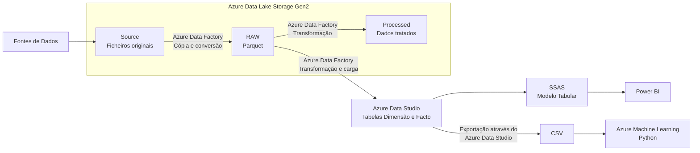

# Forecast-Vendas
Projeto de Forecast de Vendas, integrando processos ETL, Data Warehouse, modelo tabular em SSAS, Power BI e modelos preditivos de Machine Learning.

### Visão Geral
Este projeto foi desenvolvido com o objetivo de apoiar o processo de Forecast de Vendas.

O projeto contempla a exportação, transformação e carregamento dos dados (ETL), a construção de um Data Warehouse, o desenvolvimento de um modelo tabular em SSAS, a criação de modelos preditivos de Machine Learning e a disponibilização da informação através de report, dashboard e aplicação em Power BI.

### Problema de Negócio
A empresa necessitava de melhorar o processo de previsão de vendas, reduzindo o tempo gasto na preparação da informação e aumentando a fiabilidade das previsões.

Os dados encontravam-se dispersos por diferentes fontes, exigindo esforço manual para a sua integração e análise.

Este projeto pretende automatizar todo esse processo, disponibilizando informação consistente e atualizada para apoio à tomada de decisão.

## Objetivos

- Automatizar os processos de exportação, transformação e carregamento de dados.
- Centralizar a informação num Data Warehouse.
- Criar um modelo dimensional adequado à análise de vendas.
- Desenvolver um modelo tabular em SQL Server Analysis Services.
- Criar modelos preditivos para previsão de vendas.
- Avaliar a qualidade das previsões através de métricas apropriadas.
- Disponibilizar os resultados num report, dashboard e aplicação em Power BI.
- Reduzir o esforço manual necessário para preparar e analisar a informação.

## Arquitetura do Projeto

O Pipeline Master, desenvolvido no Azure Data Factory, orquestra a conversão dos ficheiros para Parquet, o processamento das tabelas de dimensão e de factos e a atualização da `DimCalendario`.

Os dados tratados são armazenados na camada `Processed` do Azure Data Lake Storage e carregados no Data Warehouse SQL. O modelo tabular desenvolvido em SQL Server Analysis Services consome os dados do Data Warehouse e é utilizado pelo Power BI através de uma ligação live.

Para a componente preditiva, um Data Flow do Azure Data Factory prepara o dataset final e armazena-o em formato CSV num container. Este dataset é posteriormente analisado em Python e utilizado no Azure Machine Learning.

## Ferramentas

| Área | Tecnologia |
|---|---|
| Integração e orquestração | Azure Data Factory |
| Armazenamento de ficheiros | Azure Data Lake Storage |
| Transformação de dados | Azure Data Factory Data Flows |
| Base de dados e Data Warehouse | Azure SQL Database ou SQL Server |
| Gestão e consultas SQL | Azure Data Studio |
| Machine Learning | Azure Machine Learning e Python |
| Modelo semântico | SQL Server Analysis Services |
| Visualização | Power BI |

forecast-vendas/
├── adf/
│   ├── datasets/
│   ├── dataflows/
│   └── pipelines/
├── azureml/
│   ├── notebooks/
│   └── models/
├── sql/
│   ├── tables/
│   ├── stored_procedures/
│   └── queries/
├── ssas/
├── powerbi/
├── data/
│   └── sample/
├── docs/
│   ├── processo_etl.md
│   ├── modelo_dimensional.md
│   ├── machine_learning.md
│   └── images/
├── requirements.txt
├── .gitignore
├── LICENSE
└── README.md

## Fontes de Dados

O projeto integra dados relativos ao período de 2022 a 2024, provenientes de diferentes fontes:

- **ERP SAP:** ficheiros exportados com informação empresarial e taxas de câmbio;
- **Base de dados interna:** dados históricos de vendas;
- **Fontes institucionais:** indicadores macroeconómicos dos países onde ocorreram vendas, incluindo desemprego, inflação, Produto Interno Bruto e preço do petróleo.

Os ficheiros originais são armazenados na camada `Source` do Azure Data Lake Storage.

## Processo ETL

O processo ETL foi desenvolvido no Azure Data Factory e é orquestrado por um Pipeline Master.

O fluxo contempla:

1. Cópia dos ficheiros originais para a camada `Source`;
2. Conversão dos dados para Parquet na camada `RAW`;
3. Transformação das dimensões e factos através de Data Flows;
4. Carregamento na camada `Processed` e no Data Warehouse SQL;
5. Atualização automática da `DimCalendario`.

Para mais detalhes, consultar a [documentação do processo ETL](docs/processo_etl.md).

## Modelo Dimensional

O Data Warehouse segue um modelo dimensional composto pelas seguintes tabelas:

### Dimensões

- `DimCliente`
- `DimEmpresa`
- `DimPais`
- `DimProduto`
- `DimProjeto`
- `DimTipoVenda`
- `DimCalendario`

### Factos

- `FactVendas`
- `FactMacros`

Foram utilizadas surrogate keys nas dimensões que não possuíam identificadores numéricos adequados. O carregamento das dimensões é realizado através de operações de upsert, garantindo a preservação das chaves e a integridade das relações com as tabelas facto.

## Modelo Semântico

O modelo semântico foi desenvolvido no Visual Studio através de SQL Server Analysis Services, mantendo a estrutura dimensional definida no Data Warehouse.

Durante a sua construção foram configurados:

- relações entre dimensões e factos;
- medidas de vendas, custos, margens e indicadores macroeconómicos;
- hierarquias temporais e de produtos;
- perspetivas de análise e vendas;
- partições para os anos de 2022, 2023 e 2024;
- roles e regras de segurança;
- traduções para inglês.

O Power BI estabelece uma ligação live ao modelo tabular, garantindo que as alterações realizadas no modelo ou nos dados são refletidas nos relatórios.

## Power BI

O relatório Power BI analisa o desempenho de vendas entre 2022 e 2024 e inclui uma componente dedicada ao contexto macroeconómico.

As principais áreas de análise são:

- sumário executivo;
- clientes;
- mercados e países;
- linhas de negócio;
- decomposição das vendas;
- contexto macroeconómico mensal;
- contexto macroeconómico anual.

Foram também desenvolvidos um dashboard, uma versão mobile e uma aplicação Power BI para centralizar o acesso aos conteúdos analíticos.

## Machine Learning

A componente de Machine Learning foi desenvolvida para complementar a análise histórica realizada no Power BI com uma estimativa do valor das vendas.

O Azure Data Factory prepara e exporta o dataset final em formato CSV. Antes da modelação, foi realizada uma análise exploratória em Python para avaliar a distribuição dos dados, valores em falta, correlações e comportamento das vendas por país, empresa, centro de lucro e tipo de projeto.

O modelo foi desenvolvido no Azure Machine Learning, incluindo:

- seleção das variáveis;
- transformação logarítmica da variável-alvo;
- divisão dos dados em treino e teste;
- treino e avaliação do modelo;
- otimização de hiperparâmetros;
- validação cruzada.

## Principais Resultados

Entre 2022 e 2024, a análise permitiu identificar:

- vendas anuais entre aproximadamente 40 M€ e 42,6 M€;
- margens brutas estáveis entre 66% e 68%;
- recuperação das vendas em 2024, com um crescimento de 6,6%;
- forte concentração das vendas no mercado angolano;
- destaque do mês de abril, associado à renovação de contratos de manutenção;
- elevada dependência de um número reduzido de clientes e mercados;
- influência do preço do petróleo e da taxa de câmbio no comportamento das vendas em Angola.

O modelo de Machine Learning obteve um coeficiente de determinação de aproximadamente `R² = 0,379`, indicando que ainda existe margem significativa para melhoria. As principais limitações identificadas foram o reduzido período histórico, a baixa correlação entre algumas variáveis e a falta de informação sobre contratos iniciados antes de 2022.

