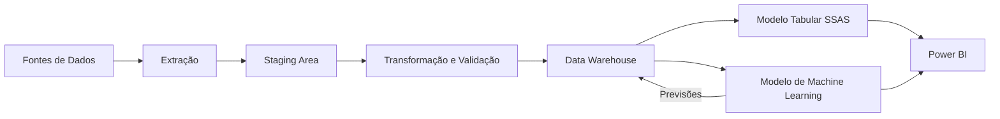

# Forecast-Vendas
Projeto de Forecast de Vendas, integrando processos ETL, Data Warehouse, modelo tabular em SSAS, Power BI e modelos preditivos de Machine Learning.

### Visão Geral
Este projeto foi desenvolvido com o objetivo de apoiar o processo de Forecast de Vendas.

A solução contempla a exportação, transformação e carregamento dos dados (ETL), a construção de um Data Warehouse, o desenvolvimento de um modelo tabular em SSAS, a criação de modelos preditivos de Machine Learning e a disponibilização da informação através de report/dashboard interativos em Power BI.

### Problema de Negócio
A empresa necessitava de melhorar o processo de previsão de vendas, reduzindo o tempo gasto na preparação da informação e aumentando a fiabilidade das previsões.

Os dados encontravam-se dispersos por diferentes fontes, exigindo um elevado esforço manual para a sua integração e análise.

Este projeto pretende automatizar todo esse processo, disponibilizando informação consistente e atualizada para apoio à tomada de decisão.

## Objetivos

- Automatizar os processos de exportação, transformação e carregamento de dados.
- Centralizar a informação num Data Warehouse.
- Criar um modelo dimensional adequado à análise de vendas.
- Desenvolver um modelo tabular em SQL Server Analysis Services.
- Criar modelos preditivos para previsão de vendas.
- Avaliar a qualidade das previsões através de métricas apropriadas.
- Disponibilizar os resultados num report, dashboard e aplicação em Power BI.
- Reduzir o esforço manual necessário para preparar e analisar a informação.


## Arquitetura da Solução




## Ferramentas

| Área | Tecnologia |
|---|---|
| Tratamento e análise de dados | Azure Data Factory, Python |
| Machine Learning | Azure Machine Learning, Python|
| Base de dados | Azure Data Studio |
| ETL | Azure Data Factory |
| Data Warehouse | Azure Data Studio |
| Modelo semântico | SQL Server Analysis Services |
| Visualização | Power BI |


## Estrutura do Repositório

```text
forecast-vendas/
├── data/
│   ├── raw/                 # Dados originais
│   ├── processed/           # Dados tratados
│   └── sample/              # Amostra de dados
├── notebooks/
│   ├── 01_exploracao.ipynb
│   ├── 02_preparacao.ipynb
│   └── 03_modelacao.ipynb
├── src/
│   ├── data/
│   │   ├── extract.py
│   │   └── transform.py
│   ├── features/
│   │   └── build_features.py
│   ├── models/
│   │   ├── train.py
│   │   └── predict.py
│   └── evaluation/
│       └── metrics.py
├── sql/
│   ├── staging/
│   ├── data_warehouse/
│   └── queries/
├── powerbi/
│   └── forecast-vendas.pbix
├── docs/
│   ├── data_dictionary.md
│   └── images/
├── tests/
├── requirements.txt
├── .gitignore
├── LICENSE
└── README.md
