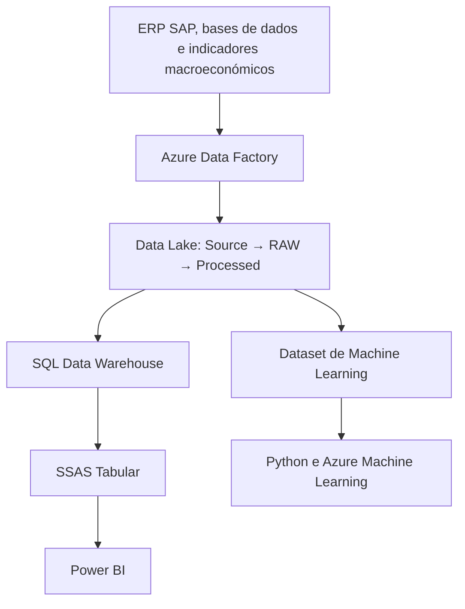

# Forecast de Vendas

Projeto desenvolvido para automatizar a consolidação, análise e previsão de vendas.

O projeto integra processos ETL, Data Lake, Data Warehouse, um modelo semântico tabular, Power BI e Machine Learning. A análise exploratória foi realizada em Python e os modelos preditivos foram desenvolvidos, otimizados e avaliados no Azure Machine Learning.

## Problema de negócio

O processo de análise e previsão de vendas dependia da consolidação manual de dados provenientes de diferentes fontes.

Esta abordagem aumentava:

- o tempo necessário para preparar a informação;
- o risco de erros e inconsistências;
- a dependência de tarefas manuais;
- a dificuldade em atualizar regularmente as análises;
- a dificuldade em incorporar indicadores externos no processo de previsão.

O projeto foi desenvolvido para automatizar este processo, centralizar a informação e apoiar o planeamento e a tomada de decisão.

## Projeto desenvolvido

O projeto integra diferentes componentes:

- pipelines ETL desenvolvidos no Azure Data Factory;
- Data Lake organizado nas camadas `Source`, `RAW` e `Processed`;
- Data Warehouse baseado num modelo dimensional;
- modelo semântico tabular em SQL Server Analysis Services;
- report, dashboard, Power BI App e versão mobile;
- análise exploratória dos dados em Python;
- modelos preditivos desenvolvidos e avaliados no Azure Machine Learning.

## Principais resultados

A análise dos dados entre 2022 e 2024 permitiu identificar:

- vendas anuais entre aproximadamente 40 M€ e 42,6 M€;
- crescimento das vendas de aproximadamente 6,6% em 2024;
- margens brutas estáveis, entre 66% e 68%;
- elevada concentração das vendas no mercado angolano;
- dependência de um número reduzido de clientes e mercados;
- maior volume de vendas no mês de abril, potencialmente relacionado com a renovação de contratos de manutenção;
- indícios de associação entre as vendas em Angola, o preço do petróleo e a taxa de câmbio.

As relações identificadas com os indicadores macroeconómicos têm natureza exploratória e não demonstram causalidade.

A componente preditiva permitiu estabelecer um primeiro baseline para futuras iterações do modelo.

## Arquitetura

O Pipeline Master do Azure Data Factory coordena a extração, transformação e carregamento dos dados.

Os dados provenientes do ERP SAP, das bases de dados e das fontes macroeconómicas são armazenados no Azure Data Lake Storage e processados através das camadas `Source`, `RAW` e `Processed`.

Após o processamento, os dados são carregados num Data Warehouse implementado em SQL Server/Azure SQL Database. O desenvolvimento e as consultas SQL são realizados através do Azure Data Studio.

O modelo tabular em SQL Server Analysis Services consome os dados do Data Warehouse e é utilizado pelo Power BI através de uma ligação live.

Em paralelo, o Azure Data Factory prepara o dataset utilizado pela componente de Machine Learning. Os dados são analisados em Python e posteriormente utilizados no Azure Machine Learning para treino, otimização e avaliação dos modelos.

## Power BI

O Power BI disponibiliza uma visão integrada do desempenho comercial e financeiro entre 2022 e 2024.

As principais áreas de análise são:

- sumário executivo;
- clientes;
- mercados e países;
- empresas e linhas de negócio;
- vendas, custos e margens;
- concentração de receita;
- contexto macroeconómico;
- evolução mensal e anual;
- forecast e avaliação das previsões.

O projeto inclui um report, um dashboard, uma Power BI App e uma versão adaptada a dispositivos móveis.

## Machine Learning

A componente de Machine Learning foi desenvolvida para complementar a análise histórica com uma estimativa do valor das vendas.

O processo incluiu:

- análise exploratória dos dados;
- análise de distribuições e correlações;
- seleção e transformação das variáveis;
- transformação logarítmica da variável-alvo;
- divisão dos dados em conjuntos de treino e teste;
- treino e otimização dos modelos;
- validação cruzada;
- avaliação das previsões.

O modelo obteve um coeficiente de determinação de aproximadamente **R² = 0,379**.

> **Importante:** Este resultado representa um baseline inicial. O modelo não é apresentado como uma solução pronta para produção, mas como um ponto de partida para desenvolvimentos futuros.

### Limitações

As principais limitações identificadas foram:

- período histórico limitado a 2022–2024;
- ausência de informação completa sobre contratos anteriores a 2022;
- reduzida capacidade explicativa de algumas variáveis;
- existência de fatores comerciais não representados nos dados;
- comportamentos distintos entre mercados e segmentos.

## Recomendações para o negócio

Com base nos resultados, foram identificadas as seguintes recomendações:

- monitorizar a concentração das vendas por cliente e mercado;
- simular o impacto de uma redução das vendas no mercado angolano;
- incorporar informação contratual e dados do pipeline comercial;
- desenvolver previsões separadas para mercados com comportamentos distintos;
- acompanhar o possível efeito da taxa de câmbio e do preço do petróleo;
- integrar as previsões e os respetivos erros no Power BI.

## Próximos passos

As prioridades para a evolução do projeto são:

- [ ] Comparar o modelo com baselines temporais;
- [ ] Adicionar métricas de avaliação como MAE, RMSE e WAPE;
- [ ] Incorporar dados contratuais e informação do pipeline comercial;
- [ ] Criar previsões por mercado e linha de negócio;
- [ ] Integrar os resultados preditivos no modelo semântico;
- [ ] Disponibilizar no Power BI a comparação entre valores reais e previstos;
- [ ] Acompanhar a evolução dos erros de previsão.

## Tecnologias

| Área | Tecnologia |
|---|---|
| Integração e orquestração | Azure Data Factory |
| Armazenamento | Azure Data Lake Storage |
| Transformação | Azure Data Factory Data Flows |
| Data Warehouse | SQL Server / Azure SQL Database |
| Desenvolvimento e consultas SQL | Azure Data Studio |
| Modelo semântico | SQL Server Analysis Services |
| Business Intelligence | Power BI |
| Análise exploratória | Python |
| Machine Learning | Python e Azure Machine Learning |

## Contributo

O projeto incluiu:

- definição do problema de negócio e das necessidades de análise;
- análise das fontes de dados disponíveis;
- identificação dos processos de negócio abrangidos;
- desenho da arquitetura do projeto;
- definição da granularidade das tabelas de facto e dimensão;
- desenvolvimento do modelo dimensional e do Data Warehouse;
- criação dos pipelines e Data Flows no Azure Data Factory;
- implementação dos processos de carregamento e atualização;
- desenvolvimento do modelo tabular em SQL Server Analysis Services;
- criação de medidas, hierarquias, roles e partições;
- desenvolvimento do report, dashboard, Power BI App e versão mobile;
- análise exploratória dos dados em Python;
- desenvolvimento, treino, otimização e avaliação dos modelos;
- interpretação dos resultados e elaboração de recomendações.

## Documentação

A documentação detalhada do projeto encontra-se organizada nas seguintes áreas:

- [Processo ETL](docs/processo-etl.md)
- [Modelo dimensional](docs/modelo-dimensional.md)
- [Modelo semântico](docs/modelo-semantico.md)
- [Machine Learning](docs/machine-learning.md)
