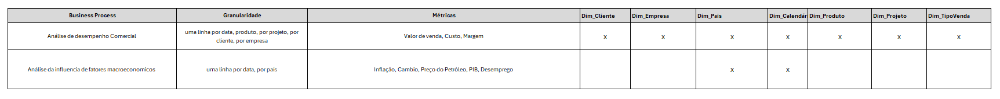
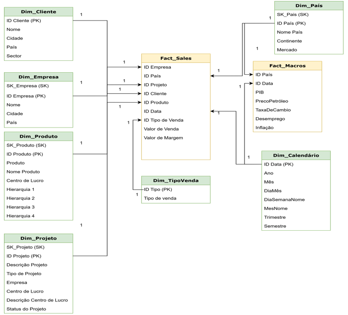

# Modelo dimensional

## Objetivo

O modelo dimensional foi desenvolvido para organizar a informação comercial e macroeconómica, apoiando as análises realizadas no Power BI e a preparação dos dados utilizados em Machine Learning.

O modelo permite analisar:

- vendas, custos e margens;
- desempenho por cliente, empresa, país, produto e projeto;
- evolução mensal e anual;
- concentração das vendas;
- contexto macroeconómico dos diferentes mercados.

## Processos de negócio

Foram identificados dois processos de negócio principais:

1. análise do desempenho comercial;
2. análise da influência de fatores macroeconómicos.

Cada processo é representado por uma tabela de factos:

| Processo de negócio | Tabela de factos | Tipo |
|---|---|---|
| Análise do desempenho comercial | `FactVendas` | transactional fact table |
| Análise da influência de fatores macroeconómicos | `FactMacros` | periodic snapshot table |

## Estrutura do modelo

O modelo é constituído por:

- 7 tabelas dimensão;
- 2 tabelas facto;

### Tabelas de dimensão

- `DimCliente`;
- `DimEmpresa`;
- `DimPais`;
- `DimCalendario`;
- `DimProduto`;
- `DimProjeto`;
- `DimTipoVenda`.

### Tabelas de facto

- `FactVendas`;
- `FactMacros`.

## Granularidade

A granularidade define o nível de detalhe representado por cada linha de uma tabela de factos.

| Tabela | Granularidade |
|---|---|
| `FactVendas` | Uma linha por registo de venda adjudicada, contextualizado por data, cliente, empresa, país, produto, projeto e tipo de venda |
| `FactMacros` | Uma linha por país e mês de referência |

A definição da granularidade antes da construção das tabelas permitiu identificar corretamente as dimensões, métricas e relações necessárias para cada processo de negócio.

## Tabelas de dimensões

### DimCliente

A `DimCliente` armazena os dados utilizados para analisar as vendas por cliente.

| Atributo | Descrição |
|---|---|
| `IdCliente` | Identificador do cliente |
| `NomeCliente` | Nome do cliente |
| `Cidade` | Cidade do cliente |
| `Pais` | País do cliente |
| `Setor` | Setor de atividade |

O identificador do cliente já existia na fonte e foi mantido por ser considerado numérico, único e válido.

### DimEmpresa

A `DimEmpresa` representa as empresas do grupo empresarial.

| Atributo | Descrição |
|---|---|
| `SK_Empresa` | Surrogate key da empresa |
| `IdEmpresa` | Identificador da empresa na fonte |
| `NomeEmpresa` | Nome da empresa |
| `Cidade` | Cidade da empresa |
| `Pais` | País da empresa |

Esta dimensão permite analisar e comparar o desempenho comercial das diferentes empresas.

### DimPais

A `DimPais` contém a informação geográfica utilizada nas análises comerciais e macroeconómicas.

| Atributo | Descrição |
|---|---|
| `SK_Pais` | Surrogate key do país |
| `IdPais` | Identificador do país na fonte |
| `Pais` | Nome do país |
| `Continente` | Continente |
| `Mercado` | Classificação como mercado nacional ou internacional |

A dimensão é partilhada pela `FactVendas` e pela `FactMacros`.

### DimCalendario

A `DimCalendario` permite analisar os dados através de diferentes níveis temporais.

| Atributo | Descrição |
|---|---|
| `IdData` | Identificador da data |
| `Data` | Data completa (dd/mm/aaaa) |
| `Ano` | Ano |
| `Semestre` | Semestre |
| `Trimestre` | Trimestre |
| `Mes` | Número do mês |
| `NomeMes` | Nome do mês |
| `DiaMes` | Dia do mês |
| `NomeDiaSemana` | Nome do dia da semana |

A dimensão é criada através de uma stored procedure e partilhada pelas duas tabelas de factos.

### DimProduto

A `DimProduto` armazena os produtos comercializados pelas empresas do grupo.

| Atributo | Descrição |
|---|---|
| `SK_Produto` | Surrogate key do produto |
| `IdProduto` | Identificador do produto |
| `Produto` | Código ou referência do produto |
| `NomeProduto` | Descrição do produto |
| `CentroLucroProduto` | Centro de lucro associado |
| `Hierarquia1` | Primeiro nível da hierarquia |
| `Hierarquia2` | Segundo nível da hierarquia |
| `Hierarquia3` | Terceiro nível da hierarquia |
| `Hierarquia4` | Quarto nível da hierarquia |

A chave do produto combina o código do produto com a empresa, uma vez que o mesmo produto pode estar associado a diferentes empresas do grupo empresarial.

### DimProjeto

A `DimProjeto` armazena a informação dos projetos associados às vendas.

| Atributo | Descrição |
|---|---|
| `SK_Projeto` | Surrogate key do projeto |
| `IdProjeto` | Identificador do projeto na fonte |
| `DescricaoProjeto` | Descrição do projeto |
| `CentroLucro` | Centro de lucro |
| `DescricaoCentroLucro` | Descrição do centro de lucro |
| `Empresa` | Empresa associada |
| `Estado` | Estado atual do projeto |
| `TipoProjeto` | Tipo de projeto |
| `LinhaNegocio` | Linha de negócio associada |

Esta dimensão permite analisar as vendas e margens por projeto, centro de lucro e linha de negócio.

### DimTipoVenda

A `DimTipoVenda` permite classificar as vendas de acordo com a respetiva natureza.

| Atributo | Descrição |
|---|---|
| `SK_TipoVenda` | Surrogate key do tipo de venda |
| `IdTipoVenda` | Identificador do tipo de venda na fonte |
| `TipoVenda` | Descrição do tipo de venda |

Esta dimensão permite distinguir, entre outros casos existentes nos dados, vendas associadas a nova venda, renovação de terceiros, manutenção própria e primeira manutenção.

## Tabelas de factos

### FactVendas

A `FactVendas` é uma tabela de factos transacional que regista as vendas adjudicadas.

A tabela está relacionada com as seguintes dimensões:

- `DimCliente`;
- `DimEmpresa`;
- `DimPais`;
- `DimCalendario`;
- `DimProduto`;
- `DimProjeto`;
- `DimTipoVenda`.

As principais métricas são:

| Métrica | Descrição |
|---|---|
| `ValorVenda` | Valor a faturar ao cliente |
| `Custo` | Custo associado à venda |
| `ValorMargem` | Margem gerada pela venda |

A tabela permite:

- analisar o desempenho das vendas;
- calcular a receita total;
- analisar custos e margens;
- comparar o desempenho por cliente, produto ou empresa;
- acompanhar a evolução temporal;
- avaliar a rentabilidade por mercado, projeto e linha de negócio;
- suportar os relatórios e indicadores do Power BI.

### FactMacros

A `FactMacros` é uma tabela de snapshot periódico. Cada linha representa o contexto macroeconómico de um país numa determinada data.

Cada registo é associado ao último dia do respetivo mês através da `DimCalendario`.

A tabela está relacionada com:

- `DimPais`;
- `DimCalendario`.

As principais métricas são:

| Métrica | Descrição |
|---|---|
| PIB | Produto Interno Bruto anual associado ao mês de referência |
| PrecoPetroleo | Preço do petróleo associado ao final do mês |
| TaxaCambio | Taxa de câmbio no último dia útil do mês |
| Desemprego | Taxa anual de desemprego associada ao mês |
| Inflacao | Taxa anual de inflação associada ao mês |

A `FactMacros` permite:

- acompanhar a evolução dos indicadores macroeconómicos;
- comparar o contexto económico dos diferentes mercados;
- enriquecer as análises comerciais com informação externa;
- explorar associações entre os indicadores e as vendas;
- suportar a preparação dos dados utilizados nos modelos preditivos.

As relações identificadas entre os indicadores macroeconómicos e as vendas têm natureza exploratória e não demonstram causalidade.

## Bus Matrix

*Figura 1 - Relação entre os processos de negócio e as dimensões utilizadas no modelo.*

### Análise do desempenho comercial

O processo de análise do desempenho comercial utiliza a `FactVendas` para avaliar as vendas, os custos e as margens.

As dimensões permitem analisar os resultados por:

- cliente;
- empresa;
- país e mercado;
- período;
- produto;
- projeto e linha de negócio;
- tipo de venda.

Esta estrutura permite identificar padrões de vendas, avaliar a rentabilidade e analisar a concentração da receita por diferentes perspetivas.

### Análise da influência de fatores macroeconómicos

O processo de análise macroeconómica utiliza a `FactMacros` para analisar os indicadores por país e período.

As principais métricas são:

- inflação;
- taxa de câmbio;
- preço do petróleo;
- PIB;
- desemprego.

A integração destes indicadores com os dados comerciais permite explorar tendências e possíveis associações com o desempenho das vendas.

## _Fact Constellation com conformed dimensions_

O esquema de _constellation_ de fatos permite que múltiplas tabelas facto compartilhem dimensões comuns. Isso facilita a análise integrada de diferentes processos de negócio.

*Figura 2 - A FactVendas e a FactMacros partilham as dimensões conformadas DimPais e DimCalendario.*
## Decisões de modelação

As principais decisões tomadas durante o desenvolvimento foram:

- separação dos processos comercial e macroeconómico em duas tabelas de factos;
- utilização de uma tabela transacional para as vendas;
- utilização de um snapshot periódico para os indicadores macroeconómicos;
- partilha das dimensões `DimPais` e `DimCalendario`;
- utilização de surrogate keys nas dimensões sem identificadores numéricos adequados;
- manutenção do identificador original da `DimCliente`;
- criação de uma chave composta para os produtos;
- criação da `DimCalendario` através de uma stored procedure.

Estas decisões permitiram construir um modelo consistente, extensível e adequado ao consumo pelo modelo semântico e pelo Power BI.
