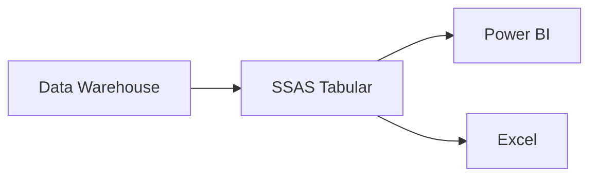
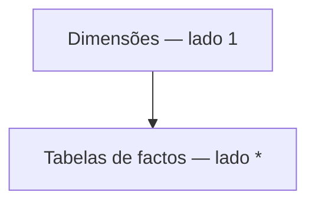
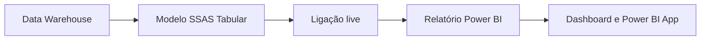

# Modelo semântico

## Objetivo

O modelo semântico foi desenvolvido em SQL Server Analysis Services para disponibilizar uma camada de negócio centralizada, consistente e preparada para análise.

O modelo centraliza:

- tabelas de factos e dimensões;
- relações;
- medidas;
- hierarquias;
- perspetivas;
- roles de segurança;
- partições;
- traduções.

Esta camada permite que as regras de negócio e os principais indicadores sejam reutilizados de forma consistente no Power BI, Excel e outras ferramentas compatíveis.

## Fonte de dados

O modelo tabular consome os dados armazenados no Data Warehouse após a execução do processo ETL.

A estrutura dimensional definida no Data Warehouse foi mantida no modelo semântico, incluindo:

- `FactVendas`;
- `FactMacros`;
- dimensões de cliente, empresa, país, calendário, produto, projeto e tipo de venda.

O modelo foi desenvolvido no Visual Studio através das ferramentas de desenvolvimento do SQL Server Analysis Services.



## Preparação do modelo

Após a importação das tabelas, foram realizados vários ajustes para melhorar a utilização e facilitar a exploração dos dados.

### Formatação

As colunas foram configuradas de acordo com a natureza dos dados, utilizando formatos como:

- moeda;
- número decimal;
- número inteiro;
- data;
- percentagem.

Esta formatação assegura uma apresentação consistente das métricas nas ferramentas de análise.

### Nomes amigáveis

As tabelas e colunas foram renomeadas para utilizar designações mais claras para o utilizador final.

| Nome técnico | Nome apresentado |
|---|---|
| `DSP13_GR03 DimCalendario` | Calendário |
| `DSP13_GR03 DimCliente` | Cliente |
| `DSP13_GR03 DimEmpresas` | Empresas |
| `DSP13_GR03 DimPais` | País |
| `DSP13_GR03 DimTipoVenda` | Tipo de Venda |
| `DSP13_GR03 DimProduto` | Produto |
| `DSP13_GR03 FactVendas` | Vendas |
| `DSP13_GR03 DimProjeto` | Projeto |
| `DSP13_GR03 FactMacros` | Macros |

A utilização de nomes amigáveis facilita a exploração autónoma do modelo no Power BI e no Excel.

### Colunas ocultadas

Foram ocultadas as colunas técnicas que não acrescentam valor direto à análise:

- surrogate keys;
- chaves primárias e estrangeiras utilizadas nas relações;
- colunas de última atualização;
- colunas técnicas utilizadas na construção de hierarquias;
- outros campos exclusivamente destinados ao funcionamento interno do modelo.

As colunas continuam disponíveis para suportar relações e regras internas, mas não são apresentadas ao utilizador final.

## Relações

As relações foram criadas entre as tabelas de dimensões e as tabelas de factos.

O modelo utiliza relações do tipo um-para-muitos:

- o lado `1` corresponde às dimensões;
- o lado `*` corresponde às tabelas de factos.



A `FactVendas` está relacionada com as dimensões de:

- cliente;
- empresa;
- país;
- calendário;
- produto;
- projeto;
- tipo de venda.

A `FactMacros` está relacionada com:

- país;
- calendário.

As dimensões de país e calendário são partilhadas pelas duas tabelas de factos.

## Hierarquias

Foram criadas hierarquias para facilitar a navegação entre diferentes níveis de detalhe.

### Calendário

A dimensão Calendário inclui duas hierarquias.

#### Hierarquia Calendário

```text
Ano
└── Mês
    └── Dia
```

Esta hierarquia permite analisar os dados desde o nível anual até ao detalhe diário.

#### Hierarquia Período

```text
Ano
└── Semestre
    └── Trimestre
        └── Mês
```

Esta hierarquia permite navegar pelos principais períodos utilizados na análise comercial e financeira.

### Produto

Foi criada uma hierarquia de produto com base nos diferentes níveis de classificação disponíveis.

```text
Hierarquia 1
└── Hierarquia 2
    └── Hierarquia 3
        └── Hierarquia 4
```

Esta estrutura permite analisar progressivamente os resultados desde uma classificação mais geral até ao nível mais detalhado do produto.

## Medidas

As medidas foram criadas nas tabelas de Vendas e Macros para centralizar os cálculos utilizados nas análises.

As principais áreas abrangidas incluem:

- vendas;
- custos;
- margem;
- margem percentual;
- crescimento;
- indicadores macroeconómicos.

> Nesta secção devem ser adicionados os nomes reais das principais medidas e, quando possível, as respetivas expressões DAX.

Uma forma recomendada de apresentar as medidas é:

| Medida | Objetivo |
|---|---|
| Total de Vendas | Calcular o valor total das vendas |
| Total de Custos | Calcular o valor total dos custos |
| Total de Margem | Calcular a margem total |
| Margem % | Calcular a margem como percentagem das vendas |

Substituir esta tabela pelos nomes e definições efetivamente utilizados no modelo.


*Medidas criadas no modelo tabular.*

## Perspetivas

Foram criadas perspetivas para disponibilizar diferentes visões do modelo de acordo com as necessidades dos utilizadores.

### Análise

A perspetiva de Análise disponibiliza o conjunto completo de informação analítica, excluindo as colunas técnicas previamente ocultadas.

Esta perspetiva permite uma exploração abrangente do modelo.

### Vendas

A perspetiva de Vendas disponibiliza a informação relevante para a análise comercial.

O objetivo é simplificar a experiência dos utilizadores da área de vendas, apresentando apenas as tabelas, atributos e medidas necessários para as suas análises.

## Partições

A tabela de vendas foi organizada em três partições:

- 2022;
- 2023;
- 2024.

Cada partição utiliza um filtro entre o primeiro e o último dia do respetivo ano.

A separação por ano permite:

- processar apenas os períodos necessários;
- reduzir o volume de dados processado em cada atualização;
- melhorar a gestão do modelo;
- preparar o modelo para a incorporação de dados de anos futuros.

> A melhoria efetiva de desempenho depende da estratégia de processamento e do volume de dados existente.

## Segurança

Foram criadas roles para controlar o acesso e a administração do modelo.

### Administrador

A role de administração foi atribuída aos elementos responsáveis pelo desenvolvimento e gestão do modelo.

Esta role permite administrar e processar o modelo sem restrições de acesso aos dados.

### Leitura

Foi criada uma role de leitura destinada aos utilizadores que consomem a informação através das ferramentas de análise.

Foi também implementado um filtro de segurança baseado no centro de lucro associado ao utilizador. O objetivo é garantir que cada responsável visualiza apenas a informação correspondente à sua área ou linha de negócio.

Esta configuração aplica segurança ao nível das linhas, restringindo os dados apresentados de acordo com o utilizador.

> Antes da publicação, confirmar se o filtro é dinâmico por utilizador e qual é a tabela utilizada para relacionar cada utilizador com o respetivo centro de lucro.

## Traduções

Para suportar a utilização do modelo num contexto internacional, foi utilizada a extensão Manage Translations no Visual Studio.

Foi adicionada a tradução:

```text
English (United States)
```

A tradução permite apresentar os nomes das tabelas, colunas e medidas em inglês quando essa cultura é selecionada pela ferramenta cliente.

## Integração com o Power BI

O Power BI consome o modelo tabular através de uma ligação live.

Esta abordagem permite:

- centralizar as medidas e regras de negócio no SSAS;
- reutilizar o mesmo modelo em diferentes relatórios;
- evitar a duplicação de cálculos no Power BI;
- aplicar as roles de segurança definidas no modelo;
- manter uma versão única e consistente dos principais indicadores.



## Resultado

O modelo semântico disponibiliza uma camada de análise preparada para utilização pelas áreas de negócio.

A solução permite:

- centralizar medidas e regras de cálculo;
- ocultar elementos técnicos;
- disponibilizar nomes amigáveis;
- navegar pelos dados através de hierarquias;
- apresentar perspetivas adaptadas aos utilizadores;
- controlar o acesso através de roles;
- gerir os dados através de partições;
- reutilizar o modelo no Power BI e no Excel.

## Decisões de modelação

As principais decisões tomadas foram:

- manutenção da estrutura dimensional do Data Warehouse;
- utilização de relações um-para-muitos;
- ocultação das chaves e colunas técnicas;
- utilização de nomes orientados ao negócio;
- criação de hierarquias de calendário e produto;
- separação da tabela de vendas em partições anuais;
- criação de perspetivas para diferentes necessidades de análise;
- implementação de segurança por centro de lucro;
- utilização de uma ligação live entre o SSAS e o Power BI.

Estas decisões permitem disponibilizar um modelo centralizado, reutilizável e adequado às necessidades de análise comercial e financeira.

---

[Voltar ao README principal](../README.md)
