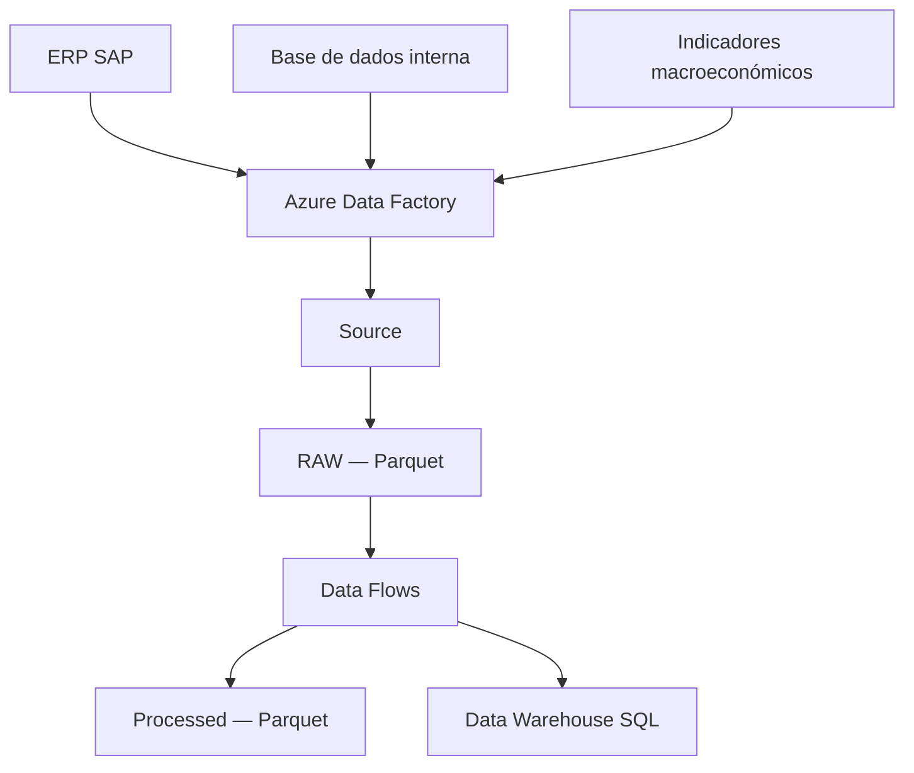

# Processo ETL

## Objetivo

O processo ETL foi desenvolvido para automatizar a extração, transformação e carregamento dos dados utilizados na análise e previsão de vendas.

O projeto integra dados de vendas provenientes da base de dados interna, dados mestre de SAP e  indicadores macroeconómicos consultados em algumas fontes institucionais online, disponibilizando informação tratada no Data Lake e no Data Warehouse.

## Fontes de dados

Os dados utilizados no projeto foram obtidos através de diferentes fontes:

| Fonte | Informação |
|---|---|
| ERP SAP | Dados mestre - clientes, empresas |
| Base de dados interna | Dados de vendas |
| Fontes institucionais | Desemprego, inflação, Produto Interno Bruto e preço do petróleo |

Os indicadores macroeconómicos foram recolhidos para os países onde ocorreram vendas durante o período analisado, entre 2022 e 2024.

## Arquitetura do processo

O Azure Data Factory é responsável pela ingestão, transformação e carregamento dos dados.

O processo utiliza o Azure Data Lake Storage como camada de armazenamento e uma base de dados SQL como Data Warehouse.

## Camadas do Data Lake

O Data Lake foi organizado num container com três camadas:

| Camada | Formato | Finalidade |
|---|---|---|
| `Source` | XLSX e formatos de origem | Armazenamento dos ficheiros recebidos das diferentes fontes |
| `RAW` | Parquet | Armazenamento dos dados convertidos para um formato otimizado |
| `Processed` | Parquet | Armazenamento dos dados após limpeza, transformação e aplicação das regras de negócio |

A conversão dos ficheiros XLSX para Parquet melhora a eficiência de armazenamento e leitura. Nesta fase, o formato dos dados é alterado sem aplicação de regras de negócio.

## Ingestão

Foram configurados datasets no Azure Data Factory para representar as diferentes fontes e destinos.

O primeiro pipeline do processo é responsável por:

1. ler os ficheiros da camada `Source`;
2. converter os ficheiros XLSX para Parquet;
3. armazenar os ficheiros convertidos na camada `RAW`.

A camada `RAW` é utilizada como origem dos Data Flows responsáveis pela preparação das dimensões e tabelas de factos.

## Transformações das dimensões

### DimCliente

As principais transformações foram:

- seleção das colunas relevantes;
- separação dos registos que continham simultaneamente a cidade e o país;
- uniformização de maiúsculas e minúsculas na coluna da cidade.

### DimEmpresa

O ficheiro foi carregado diretamente a partir da camada `RAW`, sem necessidade de transformações adicionais.

### DimPais

As principais transformações foram:

- uniformização dos nomes dos países;
- criação da coluna `Mercado`;
- classificação dos países como mercado nacional ou internacional.

### DimProduto

As principais transformações foram:

- seleção das colunas necessárias;
- uniformização dos campos de texto;
- criação de uma chave de negócio através da combinação entre o produto e a empresa.

A chave composta foi necessária porque o mesmo produto poderia estar associado a diferentes empresas.

### DimProjeto

As principais transformações foram:

- seleção das colunas relevantes;
- uniformização dos campos de texto;
- criação da coluna correspondente à linha de negócio;
- uniformização do estado dos projetos.

A linha de negócio permite analisar as vendas de acordo com a área à qual pertence cada projeto.

### DimTipoVenda

Nesta dimensão foram selecionadas apenas as colunas necessárias, sem aplicação de transformações adicionais.

## Transformações das tabelas de factos

### FactMacros

A `FactMacros` integra indicadores macroeconómicos provenientes de diferentes fontes e com diferentes granularidades temporais.

| Indicador | Granularidade original | Tratamento |
|---|---|---|
| Desemprego | Anual | Associação do valor anual aos meses do respetivo ano |
| Inflação | Anual | Associação do valor anual aos meses do respetivo ano |
| PIB | Anual | Associação do valor anual aos meses do respetivo ano |
| Taxa de câmbio | Mensal | Utilização do valor disponível no último dia útil do mês |
| Preço do petróleo | Mensal | Associação do valor disponível ao respetivo período mensal |

Para uniformizar a granularidade dos indicadores:

- foi criada uma lista com todos os meses do período analisado;
- os indicadores anuais foram associados ao último dia de cada mês;
- os indicadores foram relacionados com os países através do respetivo identificador;
- foram utilizadas condições para atribuir cada registo ao país correto;
- a taxa de câmbio foi definida como `1` para Portugal, Malta e Espanha;
- para os restantes países, foi utilizada a taxa de câmbio específica.

No tratamento do preço do petróleo, o valor disponível no primeiro dia de cada mês foi associado ao final do mês anterior. Esta aproximação deve ser considerada durante a interpretação dos resultados.

O resultado final contém as chaves de data e país, juntamente com os respetivos indicadores macroeconómicos.

### FactVendas

As principais transformações aplicadas à `FactVendas` foram:

- seleção das colunas necessárias;
- conversão das datas para o formato `datetime`;
- conversão dos valores de venda e margem para formato decimal;
- criação da chave do produto;
- aplicação das regras de negócio relativas às vendas de manutenção;
- associação às dimensões através das respetivas surrogate keys.

A chave do produto foi criada através da combinação entre a organização de vendas e o código do produto. Esta combinação permite distinguir produtos associados a diferentes empresas ou hierarquias.

Nos tipos de venda correspondentes a primeira manutenção ou manutenção, a margem foi igualada ao valor faturado quando não existiam custos associados.

Foram também identificados registos em que a margem apresentava valores negativos considerados inconsistentes. Após a análise da natureza das ocorrências, maioritariamente associadas a licenças próprias sem custos, foi aplicado o valor absoluto à margem.

Esta regra deverá ser reavaliada caso os dados passem a incluir notas de crédito, devoluções ou outras operações em que os valores negativos possuam significado contabilístico.

## Data Warehouse

Antes do carregamento, foram criadas no Data Warehouse as tabelas correspondentes às dimensões e aos factos.

Durante esta fase foram definidos:

- chaves primárias e estrangeiras;
- campos obrigatórios;
- campos que aceitam valores nulos;
- tipos de dados;
- tamanhos máximos das colunas;
- surrogate keys.

O Azure Data Studio foi utilizado para desenvolver as estruturas SQL, executar consultas e validar os dados carregados.

## Surrogate keys

Foram utilizadas surrogate keys auto-incrementadas nas dimensões que não possuíam identificadores numéricos adequados:

- `DimEmpresa`;
- `DimPais`;
- `DimProduto`;
- `DimProjeto`;
- `DimTipoVenda`.

A `DimCliente` já possuía um identificador numérico válido, pelo que esse identificador foi mantido.

Durante o carregamento da `FactVendas`, foram realizados joins com as dimensões para obter as respetivas surrogate keys:

- `DimPais`;
- `DimEmpresa`;
- `DimProjeto`;
- `DimProduto`;
- `DimTipoVenda`.

Na `FactMacros`, foi adicionada a surrogate key correspondente à `DimPais`.

## Estratégia de carregamento

As dimensões, com exceção da `DimCalendario`, utilizam uma estratégia de `upsert`.

Esta estratégia permite:

- inserir novos registos;
- atualizar registos existentes;
- preservar as surrogate keys já atribuídas;
- manter a integridade das relações com as tabelas de factos.

Um carregamento baseado em `truncate` e reinserção poderia atribuir novas surrogate keys aos registos existentes, comprometendo as relações com as tabelas de factos.

A `FactMacros` também utiliza `upsert`, permitindo o carregamento incremental dos indicadores macroeconómicos.

Depois das transformações, os dados são gravados simultaneamente:

- na camada `Processed`, em formato Parquet;
- nas respetivas tabelas do Data Warehouse.

## Dimensão calendário

A `DimCalendario` é criada através de uma stored procedure.

O intervalo do calendário é definido com base nas datas mínima e máxima existentes na `FactVendas`.

Quando a data máxima se encontra num ponto intermédio do ano, o calendário é prolongado até 31 de dezembro desse ano. Desta forma, é garantida a existência de um calendário completo para todo o último ano abrangido pelos dados.

A dimensão é reconstruída durante cada integração para permanecer sincronizada com o período disponível na tabela de vendas.

## Orquestração

Foi desenvolvido um pipeline individual para cada tabela:

- seis pipelines para as dimensões;
- dois pipelines para as tabelas de factos.

Esta separação permite:

- monitorizar individualmente cada execução;
- identificar mais facilmente a origem de erros;
- alterar um processo sem afetar diretamente os restantes;
- facilitar a manutenção da solução.

Os pipelines individuais foram agrupados em dois pipelines principais:

1. pipeline de dimensões;
2. pipeline de factos.

Cada um destes pipelines utiliza a atividade `Execute Pipeline` para executar os respetivos pipelines individuais.

## Pipeline Master

O Pipeline Master é responsável pela orquestração centralizada de todo o processo ETL.

A execução é realizada de forma sequencial:

1. ingestão e conversão dos dados da camada `Source` para a camada `RAW`;
2. transformação e carregamento das dimensões;
3. transformação e carregamento das tabelas de factos;
4. gravação dos dados na camada `Processed` e no Data Warehouse;
5. execução da stored procedure responsável pela `DimCalendario`.

A execução sequencial garante que as dimensões necessárias estão disponíveis antes do carregamento das tabelas de factos.

*Pipeline Master responsável pela coordenação do processo ETL.*

## Resultado

A solução desenvolvida permite:

- integrar dados provenientes de diferentes fontes;
- automatizar a conversão e transformação dos dados;
- preservar os dados originais;
- disponibilizar dados tratados em formato Parquet;
- carregar as dimensões e os factos no Data Warehouse;
- monitorizar individualmente os diferentes processos;
- reduzir a dependência de tarefas manuais;
- facilitar futuras alterações e necessidades de negócio.

## Decisões e limitações

Durante o desenvolvimento foram tomadas algumas decisões que devem ser consideradas na interpretação e evolução da solução:

- os indicadores anuais foram replicados pelos meses do respetivo ano;
- o valor mensal do petróleo foi aproximado através do valor disponível no primeiro dia do mês seguinte;
- a taxa de câmbio foi definida como `1` para países que utilizam a mesma moeda considerada no projeto;
- os valores negativos da margem foram corrigidos de acordo com os casos analisados;
- a `DimCalendario` é reconstruída em cada integração;
- a preservação das surrogate keys depende da correta configuração das chaves utilizadas no `upsert`.

Estas regras foram definidas de acordo com os dados e requisitos disponíveis no período analisado e deverão ser revistas caso as fontes ou regras de negócio sejam alteradas.
